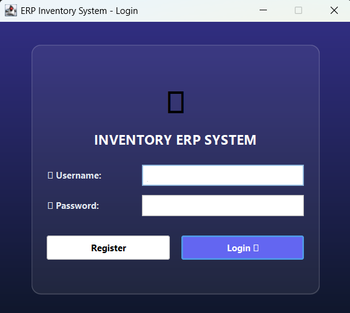
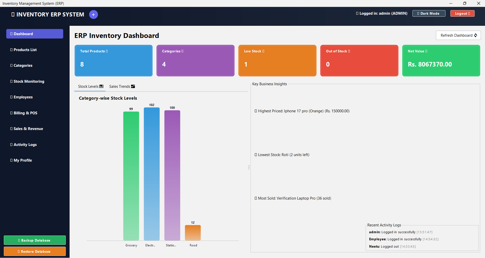
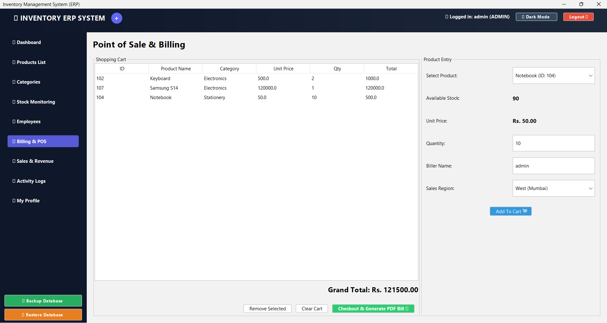
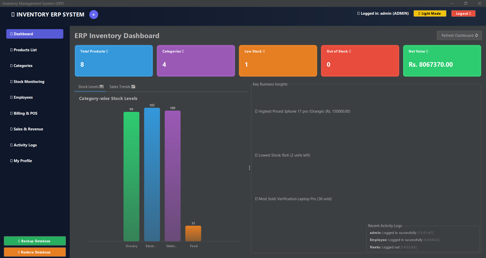
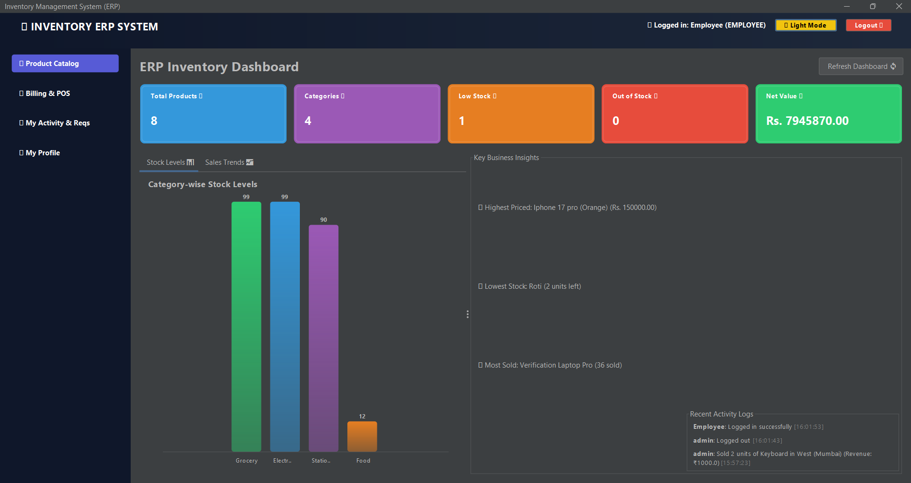
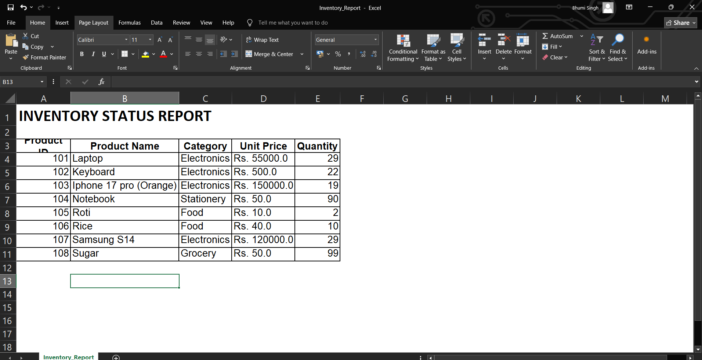
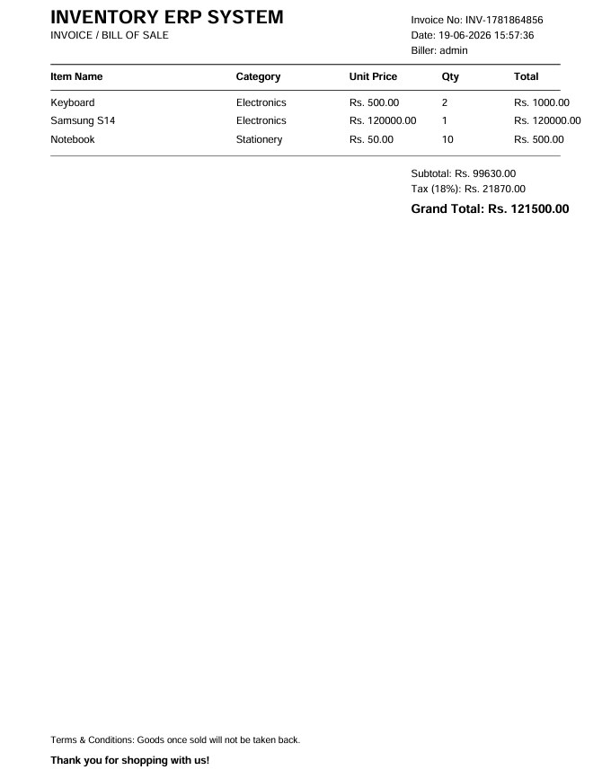
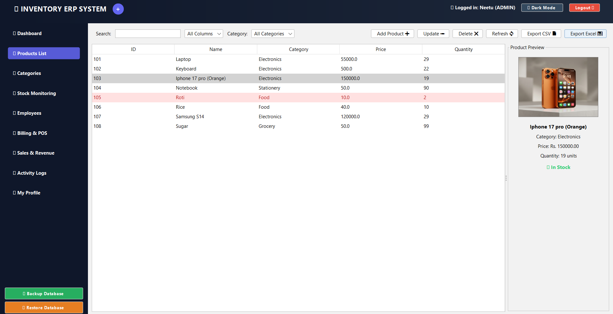
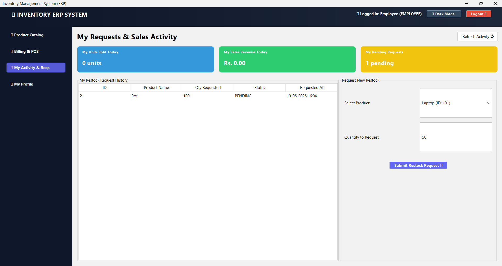
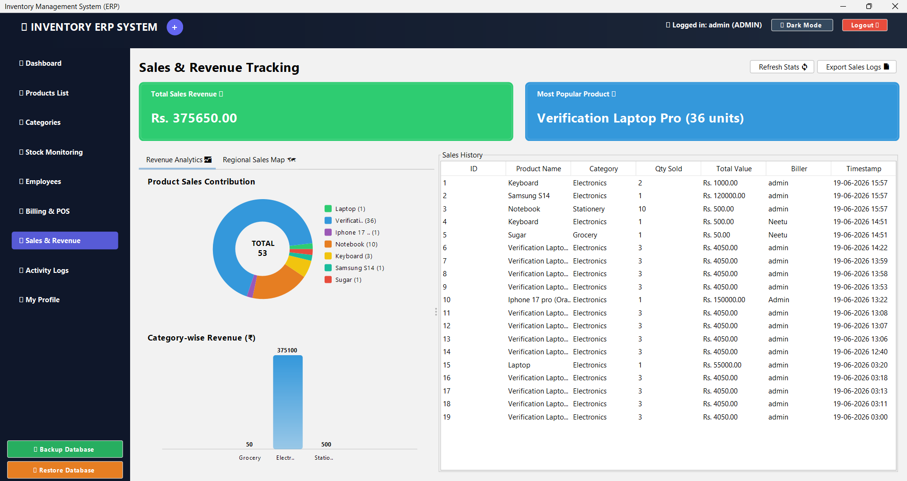

# 🚀 OutriX Inventory Management System (ERP)

A premium desktop ERP application built using **Java Swing, JDBC, and MySQL**. The system streamlines inventory management, sales tracking, employee operations, and reporting through a modern GUI with secure role-based access control.

---

## ✨ Features

### 🔐 Authentication & Security

* Secure Login System
* Role-Based Access Control (Admin & Employee)
* Change Password Functionality
* Activity & Audit Logs

### 👨‍💼 Admin Panel

* ➕ Add, Update, Delete Products
* 🔍 Advanced Product Search & Sorting
* 📂 Category Management
* 👥 Employee Management
* 📊 Interactive Dashboard & Analytics
* ⚠️ Low Stock Monitoring
* 💰 Sales & Revenue Tracking
* 📤 Export Inventory Data (CSV / Excel)
* 💾 Database Backup & Restore
* 📜 Activity Log Management

### 👩‍💻 Employee Panel

* 👀 View Products
* 🔍 Search Products
* 📦 Check Product Availability
* 🛒 Record Product Sales
* ⚠️ View Low Stock Products
* 👤 Manage Personal Profile

### 🧾 Point of Sale (POS)

* Billing Cart System
* Automatic Stock Deduction
* PDF Invoice Generation
* Sales History Tracking

### 📈 Dashboard & Reporting

* Inventory Valuation Metrics
* Category-wise Charts
* Interactive Filters
* Recent Activity Overview
* Custom Java 2D Visualizations

### 🎨 User Experience

* 🌙 Light / Dark Theme Support
* 🖼 Product Image Uploads
* 📱 Responsive Swing Interface
* Real-Time Search Filtering

---

## 🛠️ Technologies Used

* ☕ Java
* 🖥 Java Swing
* 🗄 MySQL
* 🔌 JDBC
* 🎯 Object-Oriented Programming (OOP)
* 🎨 FlatLaf (Modern UI Themes)
* 📄 PDF Generation
* 📊 Java 2D Graphics

---


## 📦 Database Setup

### Option A: Automatic Setup (Recommended)

1. Ensure MySQL Server is running.
2. Update database credentials in `src/database/DBConnection.java`.
3. Launch the application.
4. The system automatically creates:

   * `inventory_db`
   * Users table
   * Products table
   * Sales table
   * Activity logs table

### Default Credentials

| Username | Password | Role     |
| -------- | -------- | -------- |
| admin    | admin123 | Admin    |
| employee | emp123   | Employee |

---

## ▶️ How to Run

### Method 1: Using PowerShell

```powershell
javac -cp "lib/*" -d out src/database/*.java src/model/*.java src/service/*.java src/controller/*.java src/ui/*.java

java -cp "out;lib/*" ui.App
```

### Method 2: Using run.bat

1. Right-click `run.bat`
2. Click **Open**
3. Select **Option 1 – Start Inventory Management System**
4. Login and start managing inventory 🚀

---

## 🎓 Learning Outcomes

Through this project, I gained hands-on experience in:

* Object-Oriented Programming (OOP)
* Java Swing GUI Development
* JDBC Database Connectivity
* MySQL Database Design
* CRUD Operations
* Role-Based Authentication
* Event Handling
* File Handling & Data Export
* PDF Generation
* Software Architecture & Design Principles

---

## 🔮 Future Enhancements

* 🌐 Web Version using Spring Boot
* 📱 Mobile Application Support
* 📷 QR Code Product Tracking
* ☁️ Cloud Database Integration
* 📧 Email Notifications for Low Stock
* 📊 Advanced Business Analytics
* 🔔 Real-Time Inventory Alerts

---

## 📸 Screenshots

### Login Page


### Admin Interface


### Billing


### Dark Mode Feature


### Employee Interface


### Inventory Excel


### Invoice Generation PDF


### Product List


 ### Restock Request Feature


### Sales Tracking Feature


### 💡 "Efficient inventory management is the backbone of every successful business."

Made with ☕ Java, JDBC, MySQL, and lots of debugging 😄
